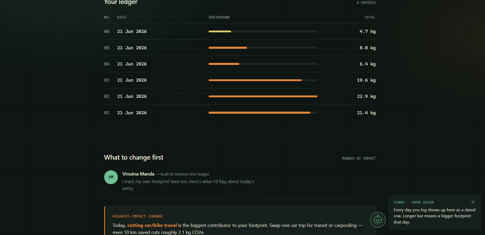

# Carbon Ledger



**An honest account of your daily footprint.**

Carbon Ledger is a lightweight web app that helps people understand and reduce their day-to-day environmental impact. Instead of a one-time quiz, it treats your footprint like a ledger: log a day, see exactly what it cost, and get the single change that would matter most — then watch the trend build over time.

Built for **PromptWars 2026 — Main Challenge 3: Carbon Footprint Awareness Platform**.

## What it does

- **Daily entry log** — captures car/bike travel, public transit, household electricity, cooking/LPG use, diet, occasional flights, and waste habits.
- **Live instrument reading** — a real-time gauge shows today's estimated emissions in kg CO₂e as you adjust inputs, color-coded against a sustainable daily target (2.3 kg CO₂e).
- **Running ledger** — every logged day is saved locally in the browser (no backend, no account) and shown as a dated row with a relative impact bar, so patterns become visible over a week or a month.
- **Ranked insight** — after each entry, the app identifies the single largest contributor to that day's footprint and gives one concrete, high-impact action to address it — not a generic list of tips.

## Why this approach

Most carbon calculators give a one-off number and a static tip list. Carbon Ledger is built around two ideas: (1) awareness compounds when you track over time, not just once, and (2) people act on one clear, ranked recommendation more than on ten generic ones. The "ledger" framing — entries, running totals, dated rows — borrows the language of bookkeeping to make an abstract number feel like something you're actively managing.

## Tech stack

Vanilla HTML, CSS, and JavaScript — no frameworks, no build step. Calculation logic lives in `calc.js`, a dependency-free module shared between the browser UI and the test suite, so the math driving the app is verified independently of the DOM. State is stored in the browser via `localStorage`. The instrument-style gauge is drawn natively with the Canvas API.

This was a deliberate choice for the challenge: zero dependencies means zero install friction for evaluators, and instant deployment on GitHub Pages.

## Testing

`calc.js` is fully decoupled from the DOM, so it's unit-testable with plain Node — no test framework to install.

```
npm test
```

Covers: linear scaling of emission factors, non-negative totals under edge cases, graceful handling of invalid/negative input, the recycling discount, and correct identification of the highest-impact category across multiple scenarios. Run `node test.js` directly if npm isn't available.

## Security

No backend, no API calls, no third-party scripts, and no data ever leaves the browser — entries are read and written only to `localStorage` on the user's own device. All inputs are constrained `range`/`select`/`checkbox` controls rather than free text, so there's no user-controlled string ever written into the DOM, removing the usual XSS surface for a form-driven app.

## Accessibility

Every form control has a programmatically associated `<label for>` (or native label-wrapping for checkboxes), the waste-habit checkboxes are grouped in a `<fieldset>`/`<legend>`, focus states are visible (`:focus-visible`), and `prefers-reduced-motion` is respected. Layout is responsive down to mobile.

## Efficiency

A single static HTML file plus one small JS module — no bundler, no external requests, no render-blocking dependencies. All per-entry calculations are O(1); the ledger view is the only O(n) operation (n = logged days), rendered on demand rather than on every keystroke. Two specific fixes worth noting: color lookups for the gauge and ledger bars are resolved through a pure `classifyTotal()` function and a static color map rather than `getComputedStyle()`, avoiding a forced style/layout recalculation on every slider drag; and the background uses `background-attachment: scroll` (the default) rather than `fixed`, since `fixed` is a known cause of main-thread repaint on scroll in several browsers.

## Emission factors used

| Category | Factor |
|---|---|
| Car / bike travel | 0.21 kg CO₂e / km |
| Public transit | 0.09 kg CO₂e / km |
| Household electricity (India grid average) | 0.82 kg CO₂e / kWh |
| Short-haul flight | 0.15 kg CO₂e / km |
| Diet (vegan → meat-heavy) | 1.5 – 5.4 kg CO₂e / day |

These are illustrative averages intended to build awareness and show relative impact, not a certified carbon audit.

## Run it locally

Just open `index.html` in a browser — there's nothing to install or build. To run the test suite, you'll need Node installed; then run `npm test` from the project folder.

## Live demo

[https://vinutnamanda.github.io/carbon-ledger/](https://vinutnamanda.github.io/carbon-ledger/)

## Author

Vinutna Manda — [LinkedIn](https://linkedin.com/in/vinutna-manda-577874266) · [GitHub](https://github.com/vinutnamanda)
